# Tugas 3 IF3110 Pengembangan Aplikasi Berbasis Web

Melakukan upgrade Website ojek online sederhana pada Tugas 2 dengan mengaplikasikan ***cloud service* (Firebase Cloud Messaging) dan *framework* MEAN stack**.

## Tujuan Pembuatan Tugas

Mengerti :
* MEAN stack (Mongo, Express, Angular, dan Node)
* *Cloud service* Firebase Cloud Messaging (FCM) dan kegunaannya.
* Web security terkait access token dan HTTP Headers.

## Anggota Tim
1. Jordhy Fernando (13515004)
2. Sylvia Juliana (13515070)
3. Stevanno Hero Leadervand (13515082)

### Tampilan Program
Halaman Login

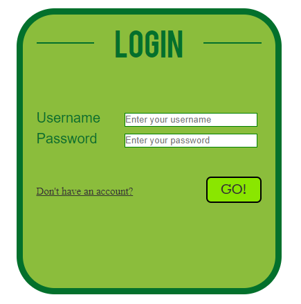

Halaman Sign Up

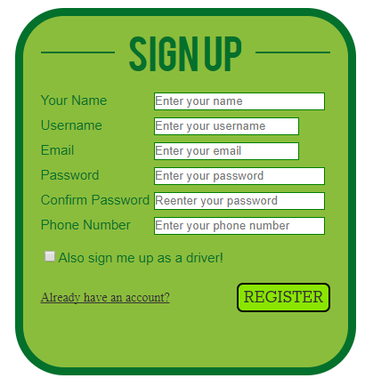

Halaman Order pada Pengguna

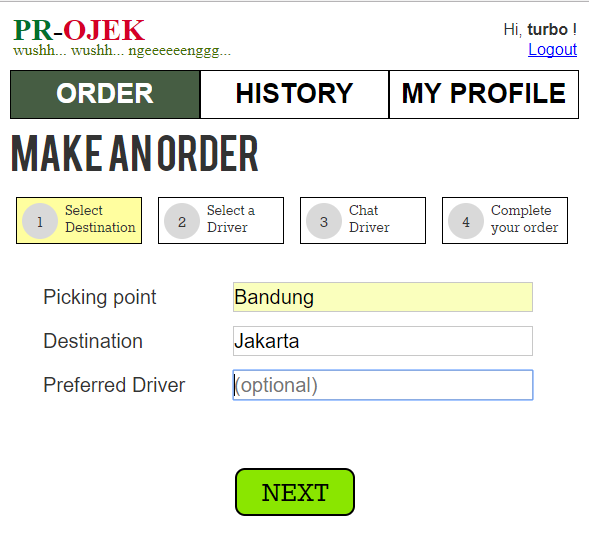

Halaman Select Driver

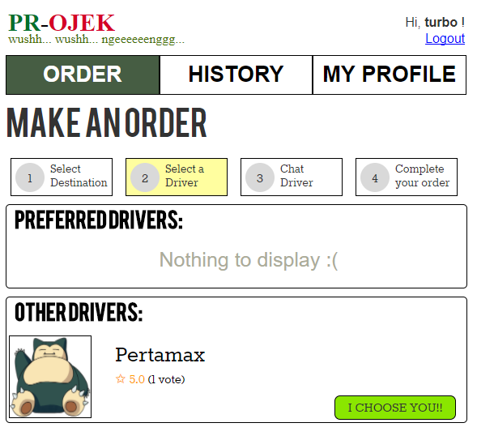

Halaman Order pada Driver

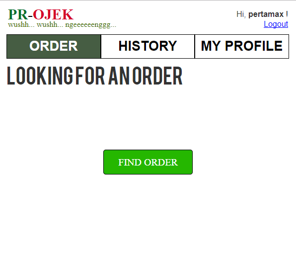

Halaman Order pada Driver Ketika Melakukan Finding Order

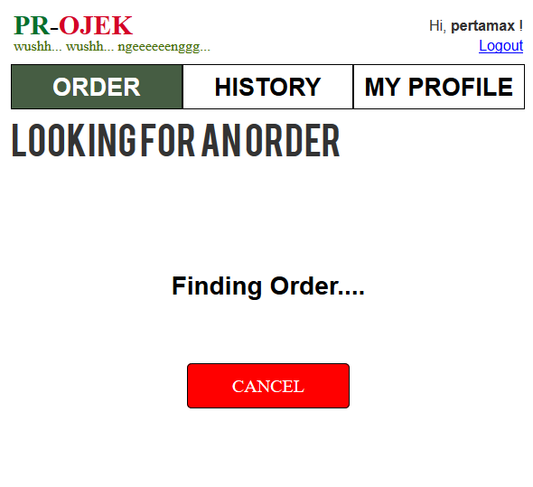

Halaman Order pada Driver Ketika Mendapat Order

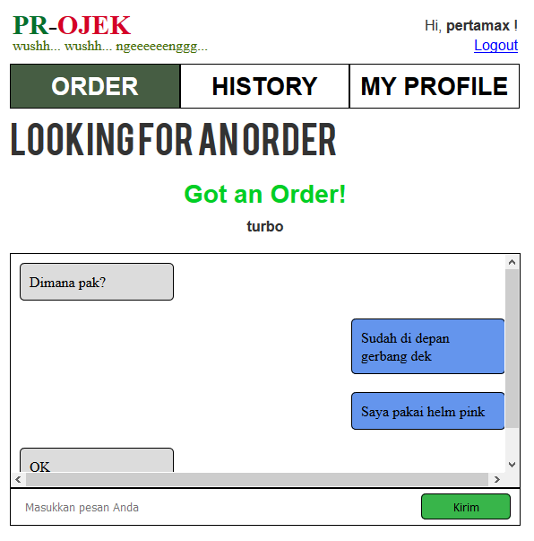

Halaman Chat Driver pada Pengguna

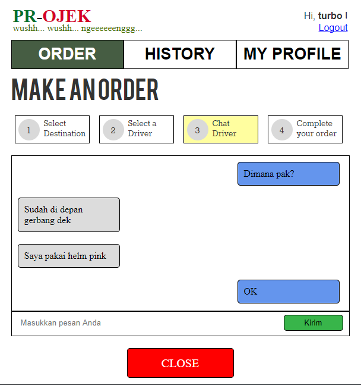

Halaman Complete Order

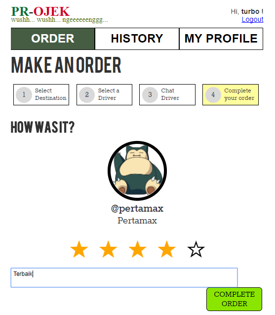

Halaman Previous Order

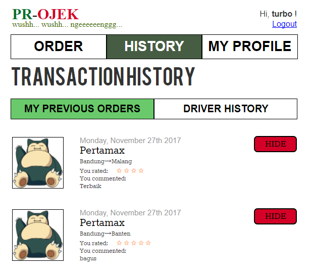

Halaman Driver History

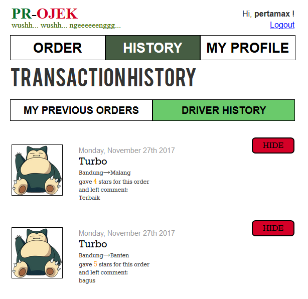

Halaman Profile

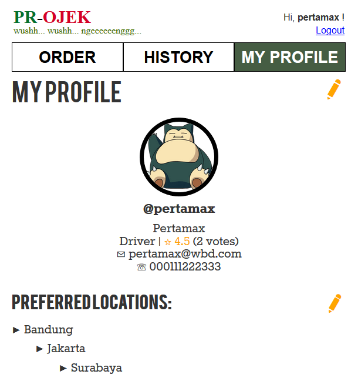

Halaman Edit Profile

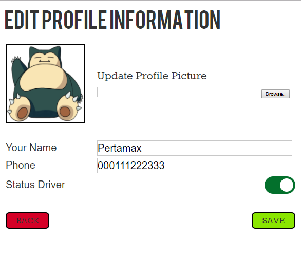

Halaman Edit Preferred Location

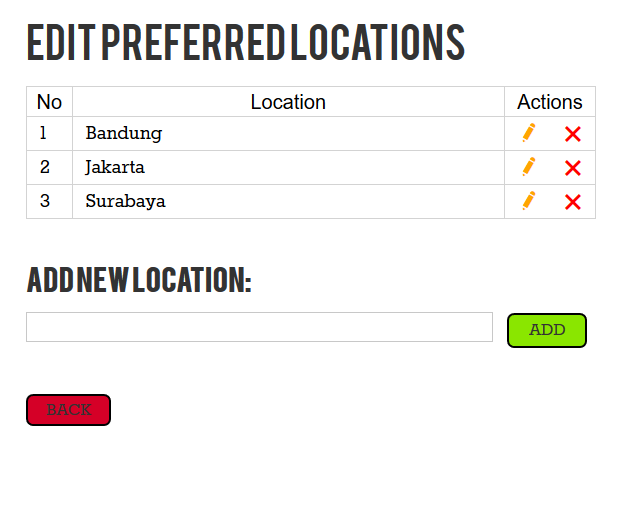

### Pembagian Tugas

Chat App Front-end:
1. Halaman order customer - 13515070
2. Halaman chat driver & order driver - 13515004, 13515070
3. Halaman chat customer - 13515004, 13515070
4. Penerimaan pesan dari FCM - 13515082

Chat REST Service:  
1. Penyimpanan history chat - 13515004, 13515070
2. Pengiriman pesan ke FCM - 13515004
3. Pengambilan history chat - 13515004, 13515070
4. Penyimpanan online user - 13515004, 13515082
5. Penghapusan online user - 13515004, 13515082
6. Pengambilan daftar driver - 13515004, 13515082

Fitur security (IP, User-agent):
1. Pembuatan token - 13515004
2. Validasi token - 13515070, 13515082

